# UT1_PC01: Fundamentos de la programación.

## 1º [CE. a] En primer lugar vamos a comprobar las características principales de los lenguajes de programación a través de los ejercicios prácticos que habéis realizado. Los ejercicios serán los siguientes:

Debéis elegir 1 ejercicio de UT1.A00 Introducción a la programación - parte 1.

El ejercicio elegido es el 1.3

Debéis elegir 2 ejercicios de UT1.A00 Introducción a la programación - parte 2.

Los ejercicios elegidos son 2.8 y 2.15

Debéis comparar los tres ejercicios con otros lenguajes de programación, debéis explicar las características principales de cada uno, y compararlo con al menos 2 lenguajes de programación diferentes al usado en la actividad.

Los lenguajes que vamos a utilizar para la comparación son: Javascript y PHP.

A continuación iremos ejercicio a ejercicio comentando las caracteristicas principales de ellos y comparando las caracteristicas principales 

### Ejercicio 1.3

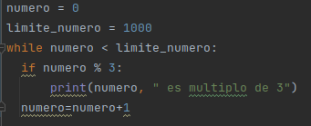

A la hora de definir variables:
- En Python se puede definir de la siguiente manera --> numero = 0
- Mientras que en Javascript es --> var numero = 0; y además se pueden declarar diferentes variables con "let" o "const" teniendo cada una un ámbito y alcance diferente
- En PHP --> $numero = 0; 

Además tanto PHP como Javascript necesitan ";" mientras que Python es un lenguaje de programación indentado.

### Ejercicio 2.8

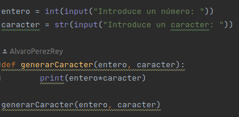

A la hora de hablar de datos primitivos:
- En Python existen 4 tipos como son int, float, bool y str
- En JS existen 7 tipos: undefined, Boolean, String, Number, BigInt, Symbol y null
- Mientras que en PHP existen 10 tipos: boolean, integer, float, string, array, object, callable, iterable, resource y NULL

Otro punto en el que difieren estos lenguajes es a la hora de comentar el código:
- En Python utilizamos "#" para iniciar un comentario
- En JS escribimos "//" para escribir un comentario de una sola linea y "/*" "*/" para escribir comentarios de varias lineas
- En PHP se utilizan tambien "//" para escribir un comentario de una sola linea 

### Ejercicio 2.15

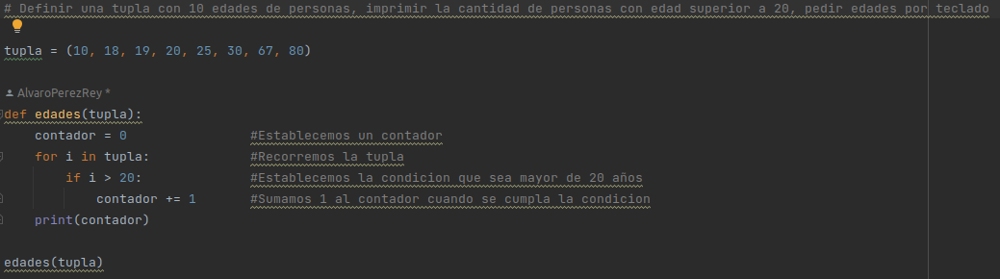

La estructura de datos en estos lenguajes son diferentes como por ejemplo:
- Las tuplas en Python es una estructura parecia a una lista pero esta es inmutable, por lo que no pueden ser modificadas durante la ejecucion del programa
- En JS no existe una estructura de datos incorporada con las mismas caracteristicas especificas como tal.
- En PHP una estructura parecida, que no igual, son los arrays.

Respecto a los bucles for:
- En Python escribimos la palabra clave "for" seguida del nombre de la variable del ciclo, la palabra clave "in" y una llamada a la funcion range() especificando los parámetros necesarios seguido de ":"
- En JS debemos especificar varios valores explícitamente como son la palbra clave "for" seguido de un parentesis donde vamos a definir la variable de ciclo con su valor inicial, la variable para detener el bucle y como se actualizara la variable en cada iteración
- En PHP pasa exactamente igual que en JS.

## 2º [CE. b] En esta actividad vamos a realizar una comparación entre Python y C, es por ello que debes elegir tres de los ejercicios de los realizados en clase y contestar a las siguientes preguntas.

Vamos a elegir los ejercicios 1.2, 2.9 y 2.16

### Ejercicio 1.2

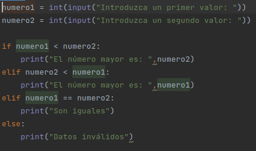

¿Qué diferencias habría en el desarrollo del programa?

- Las variables en C se tienen que declarar su tipo mientras que en Python no es necesario obligatoriamente.

¿Qué diferencias existen entre los dos lenguajes?

La estructura if en C se representa como:
-       if (condición) {
            Instrucción 1;
            Instrucción 2;
            Instrucción n;
        }
        else {
            Instrucción A;
            Instrucción B;
            Instrucción Z
        } 
y en Python como se muestra en el ejercicio.
- Python es un lenguaje interpretado mientras que C es un lenguaje compilado

¿Para qué tipo de programa puede servir cada lenguaje?
- Python es normalmente utilizado para el aprendizaje automatico o incluso desarrollo web mientras que c se utiliza para el desarrollo de aplicaciones relacionadas con hardware, sistemas operativos...

¿Cómo sería el proceso de lectura del código fuente de cada programa?
- En Python se compila primero en un código de bytes y luego es interpretado por un gran programa en C mientras que en C se compila directamente en el código maquina que se ejecuta por la CPU.

### Ejercicio 2.9

¿Qué diferencias habría en el desarrollo del programa?
- Creacion de una funcion se realizaria de una manera diferente, en C tenemos que declarar el tipo de la funcion y sus estructuras dentro de la misma serian diferentes. Tambien la declaración de variables y las estructuras de control.

### Ejercicio 2.16

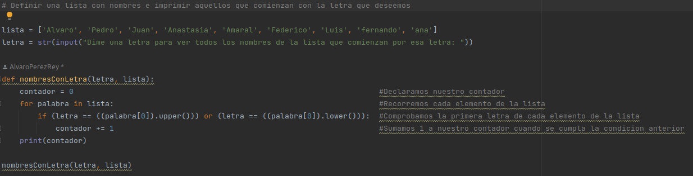

¿Qué diferencias habría en el desarrollo del programa?
-   A la hora de declarar una lista en lenguaje C se utilizaría un Array, además la declaración de la función sería diferente ya que estamos trabajando con Arrays deberiamos de indicar este tipo al principio de la función.
- Tambien nuestro bucle y nuestro condicional ya que en lenguaje C se estructuran de una manera diferente.

## 3º [CE. c] Teniendo todos los ejercicios realizados y entregado. Sobre el código fuente creado en la relación de ejercicios de las actividades 0 y 1 de la unidad, realiza en un documento los comentarios sobre todos los ejercicios indicando que elementos del código fuente has utilizado y qué función tienen.

### Ejercicio 1.1

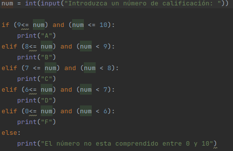

### Ejercicio 1.2

### Ejercicio 1.3

### Ejercicio 2.1

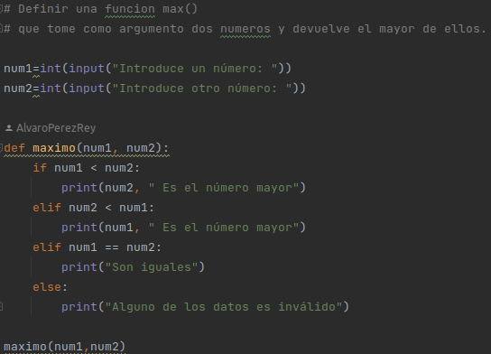

### Ejercicio 2.2

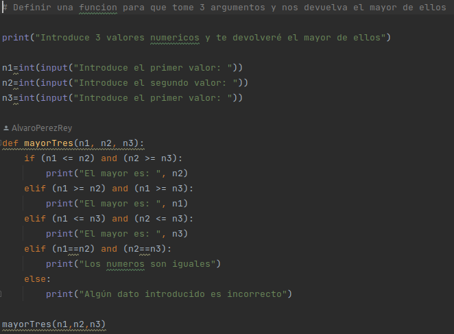

### Ejercicio 2.3

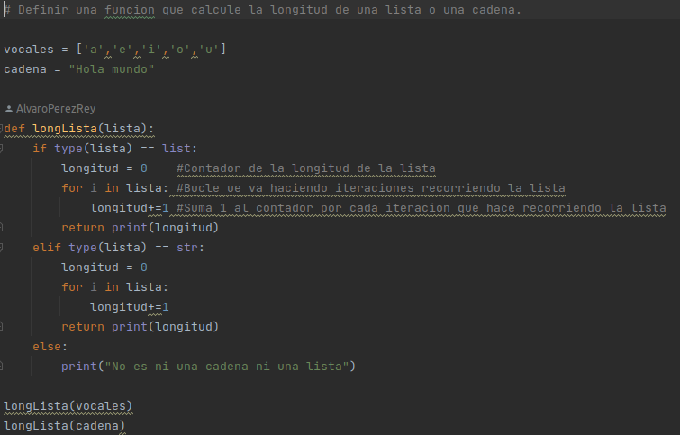

### Ejercicio 2.4

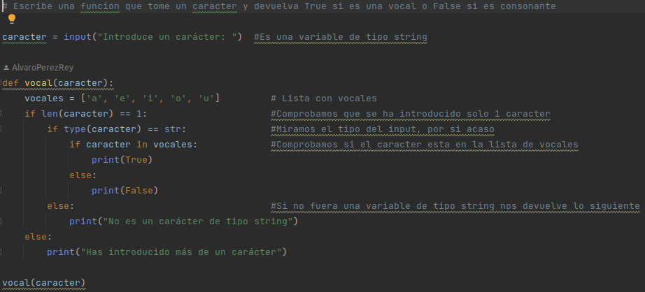

### Ejercicio 2.5

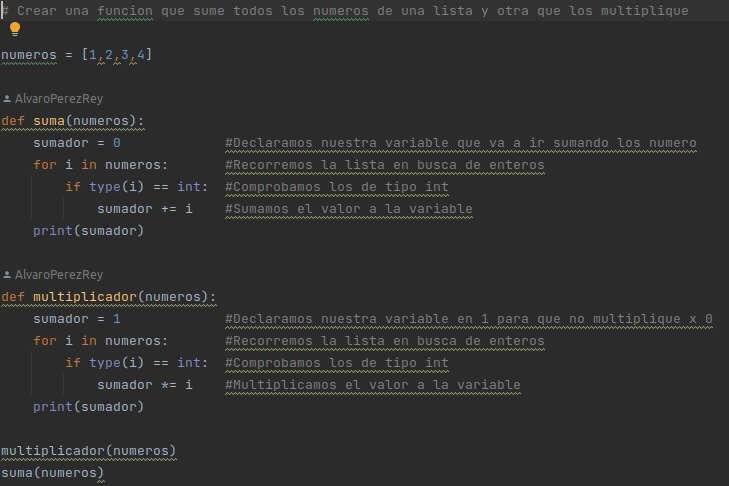

### Ejercicio 2.6

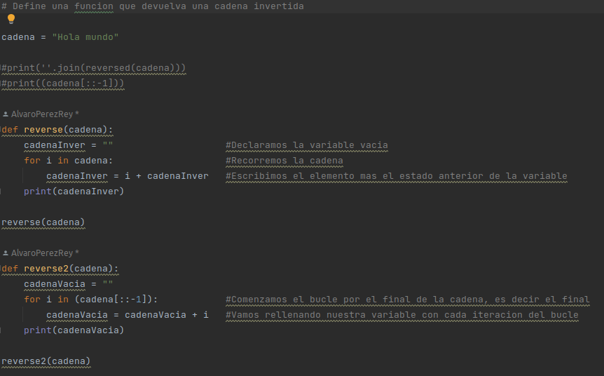

### Ejercicio 2.7

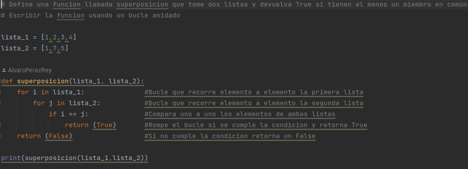

### Ejercicio 2.8

### Ejercicio 2.9

### Ejercicio 2.10

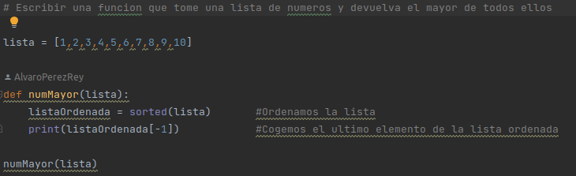

### Ejercicio 2.11

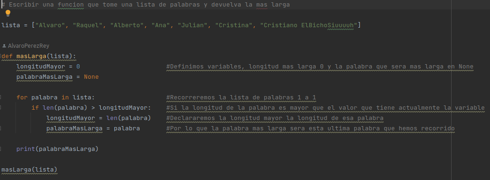

### Ejercicio 2.12

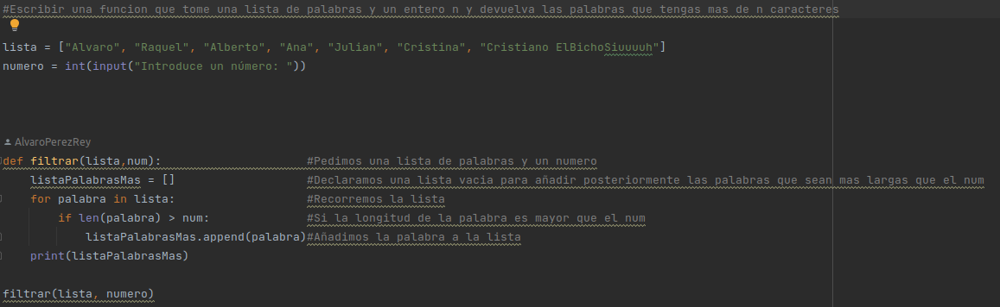

### Ejercicio 2.13

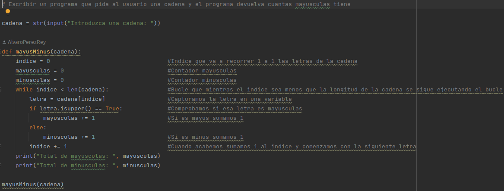

### Ejercicio 2.14

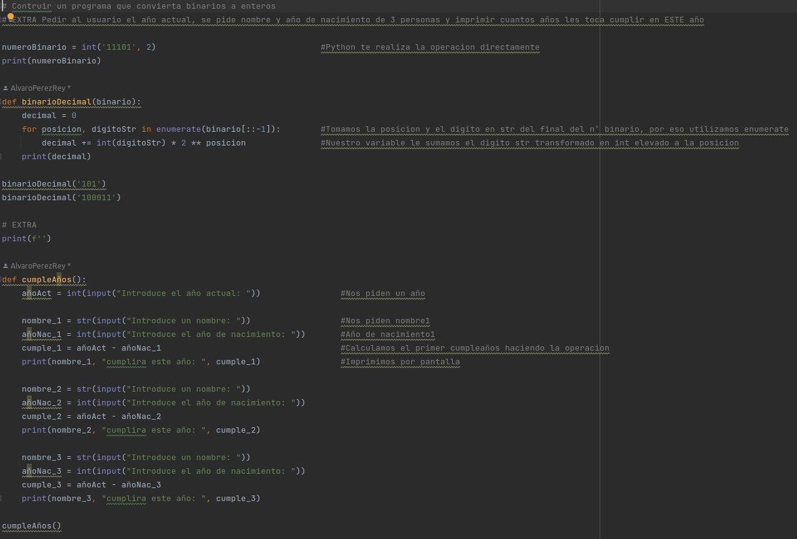

### Ejercicio 2.15

### Ejercicio 2.16

### Ejercicio 2.17

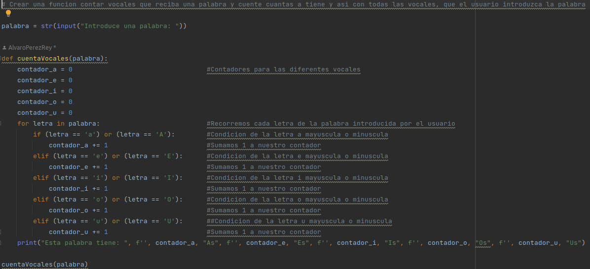

### Ejercicio 2.18

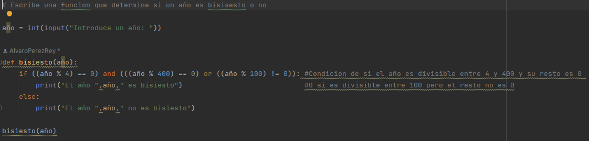

